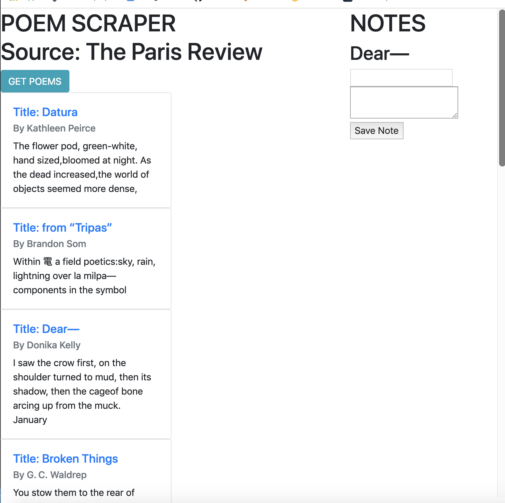

# Poem Scraper

18WK_TrilogyBootcamp_Homework

======
**Poem Scraper** is a website scraper that allows users to save a note about poems that they enjoyed from the featured poems on the Paris Review's website.

#### Screenshot


## Link to github
* [Version 1.0] https://github.com/nholdsworth/NewsScraper(https://github.com/username/sw-name/archive/master.zip)


## Usage

```$ git clone git@github.com:nholdsworth/NewsScraper.git```


    Then do an npm install to make sure all the dependencies are available.

    Then from the terminal start up the server in node
    and go to localhost:3000 in the browser.

    This app is also deployed on Heroku and may be used online by going to:  * https://boiling-reef-44186.herokuapp.com/

    all you do is click the get poems button to look for all available poems that are currently not already saved into the database.  

    You can click on the title of a poem in order to see more of it on the paris review's website, unfortunately, without subscribing to the magazine you will be unable to read the whole poem.

    to save a note about the poem simply click in the body of the poem excerpt.

    give your Note a title and some content, then click save to have the note saved to the database.  Now when you click the article excerpt again, the note will reappear.
    
     

## Contributors

### Contributors on GitHub
* [Contributors](https://github.com/nholdsworth/NewsScraper/graphs/contributors)

### Third party libraries

    "axios": "^0.18.0",
    "cheerio": "^1.0.0-rc.2",
    "express": "^4.16.4",
    "express-handlebars": "^3.0.2",
    "mongoose": "^5.4.15",
    "morgan": "^1.9.1"

## Version 
* Version 0.7
